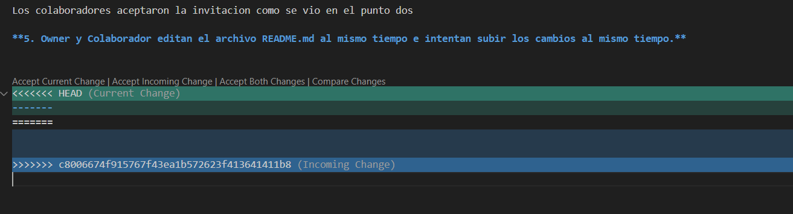
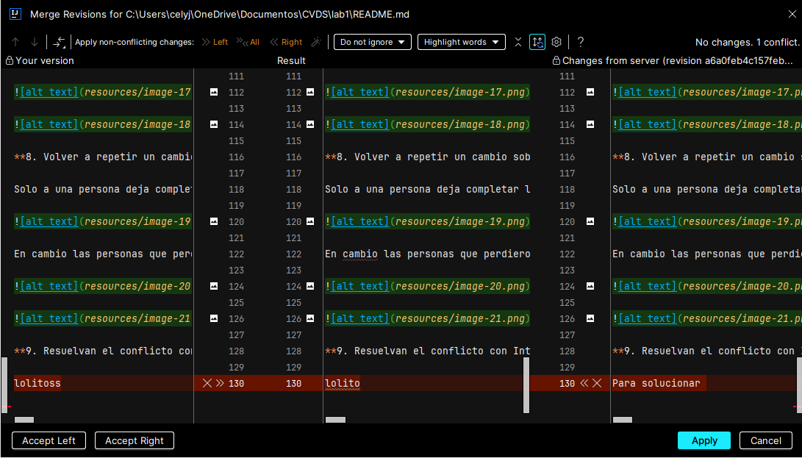

# LABORATORIO 1

## INTEGRANTES:
-David Santiago Castro Sierra

-Juan David Zambrano Gonzalez

-Juan Esteban Cely Lopez

## RESPUESTAS:

### Parte 1 (trabajo individual)

**1. Crea un repositorio localmente.**
 
Creamos el directorio en GitHub y luego lo clonamos en la carpeta ciclos de manera local de la siguiente manera: 
 

**2.	Agrega un archivo de ejemplo al repositorio, el **README.md** puede ser una gran opción.**

Creamos el README y se añade al repositorio, en otro paso aparte se crea la carpeta resources para meter ahi las imagenes de este documento y asi que se pueda ver mas ordenado

**3.	Averigua para qué sirve y como se usan estos comandos **git add** y **git commit -m “mensaje”**** 

**-Git add:** Es el comando que sirve para añadir archivos al entorno git de preparación o en su defecto los cambios realizados en dichos archivos

    
**-Git git commit -m “mensaje”:** Este comando sirve para guardar dichos cambios que se tenian en el area de preparación en el repositorio local con un mensaje especifico sobre los cambios realizados, para tener un mayor control de dichos cambios realizados en el commit

**4. Abre una cuenta de github, si ya la tienes, enlazala con el correo institucional.**

**5.	Crea un repositorio en blanco (vacío) e GitHub.**

Se creo primero el repositorio vacio en GitHub y luego se clono localmente, posteriormente se hizo la parte del README.md

**6.	Configura el repositorio local con el repositorio remoto.**

Se configuro de la manera local clonando el repositorio de la manera remota

y se realizo :

**7. Sube los cambios, teniendo en cuenta lo que averiguaste en el punto 3 Utiliza los siguientes comando en el directorio donde tienes tu proyecto, en este orden:**

Hacemos el commit de la actualización del readme que estamos elaborando

**8. Configura el correo en git local de manera correcta Configurar correo electrónico en GitHub**

Se configuró git de la siguiente manera

**9. Vuelve a subir los cambios y observa que todo esté bien en el repositorio remoto (en GitHub).**

Verificamos los cambios:

### PARTE II (Trabajo en parejas)

**1.	Se escogen los roles para trabajar en equipo, una persona debe escoger ser "Owner" o Propietario del repositorio y la otra "Collaborator" o Colaborador en el repositorio.**

Se definio 
owner: 
David Santiago Castro Sierra

Collaborators :
Juan David Zambrano Gonzalez
Juan Esteban Cely Lopez

**2. El owner agrega al colaborador con permisos de escritura en el repositorio que creó en la parte 1**

Se agregaron los siguientes colaboradores:

**3. El owner le comparte la url via Teams al colaborador**

Se invito a los colaboradores al repositorio

**4. El colaborador acepta la invitación al repositorio**

Los colaboradores aceptaron la invitacion como se vio en el punto dos

**5. Owner y Colaborador editan el archivo README.md al mismo tiempo e intentan subir los cambios al mismo tiempo**

**6. ¿Que sucedió?**

Solo a una persona deja completar los cambios de manera exitosa y a los otros no

**7. La persona que perdió la competencia de subir los cambios, tiene que resolver los conflictos, cúando haces pull de los cambios, los archivos tienen los símbolos <<< === y >>> (son normales en la resolución de conflictos), estos conflictos debes resolverlos manualmente. Como resolver Conflictos GitHub**

Las personas que perdieron los cambios resolvieron el problema usando el siguiente comando

**8. Volver a repetir un cambio sobre el README.md ambas personas al tiempo para volver a tener conflictos.**

Solo a una persona deja completar los cambios de manera exitosa y a los otros no

En cambio las personas que perdieron les  salio

**9. Resuelvan el conflicto con IntelliJ si es posible, Resolver conflictos en IntelliJ**

Vemos que nos salen problemas los cuales abordaremos de la siguiente forma 

Entonces le dimos merge para mirar los cambios afectados y poder escoger el archivo que mas nos conviene 

Entonces vemos los cambios afectados en la ultima linea de codigo donde aceptamos el de la derecha para resolver este conflicto

### PARTE III (Trabajo de a parejas)

**1. ¿Hay una mejor forma de trabajar con git para no tener conflictos?**

Podemos usar las siguientes formas para evitar conflictos:

1. Crear ramas, en donde cada colaborador trabajara en su propia rama para evitar conflictos en la rama main haciendo que los cambios se manejen de manera controlada
2. Hacer commits con frecuencia ayuda a tener un historial de cambios lo que puede facilitar las cosas para resolver conflictos
3. Antes de comenzar a trabajar actualizar los cambios de las ramas donde se esten trabajando para tener los ultimos cambios y minimizar los conflictos
4. Hacer una verificacion del codigo y sus respectivas pruebas antes de subir los cambios
5. Tener una buena comunicación con el equipo hace que los cambios sean cordinados y minimiza los conflictos que se pueden presentar 

**2. ¿Qué es y como funciona el Pull Request?**

Pull Request nos pertmite enviar una solitud para poder juntar los cambios realizados que hemos realizado de una rama a otra, donde seran verificados y revisados por otros integrantes del equipo antes de subirlos a la rama en cuestion. Es esencial en proyectos colaborativos para asegurar que el código añadido o modificado sea revisado y aprobado por otros miembros del equipo.

**3. Creen una rama cada uno y suban sus cambios.**

Se crearon las siguientes ramas:

**4. Tanto owner como colaborador hacen un cambio en el README.md y hacen un Pull Request (PR) a la rama main/master**

En donde cada integrante Realizo el pull request:

**5. Teniendo en cuenta la recomendación, mezclen los cambios a la rama main a través de PR con el check/review/approval del otro compañero (Cuando se hace merge se deberían borrar las ramas en github)**

En donde la configuracion quedo realizada:

Por ultimo tenemos la aprobacion de al menos un compañero y donde veremos que si se elimino la rama:

En donde ya no esta la rama feature/David-Castro

